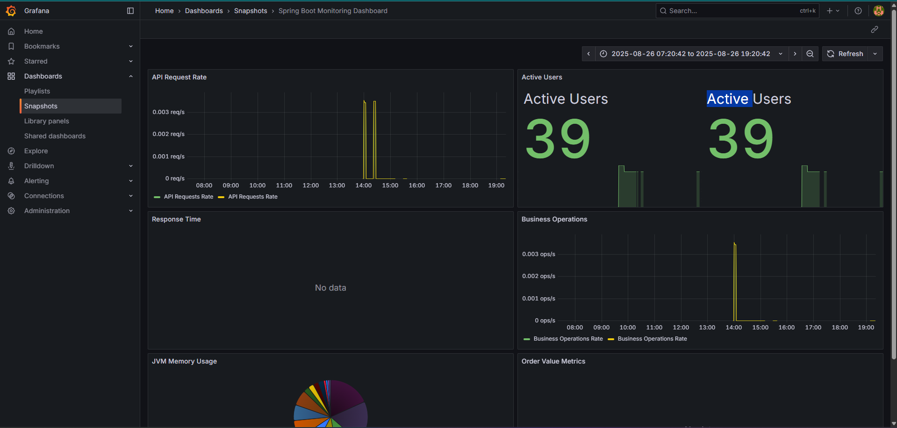
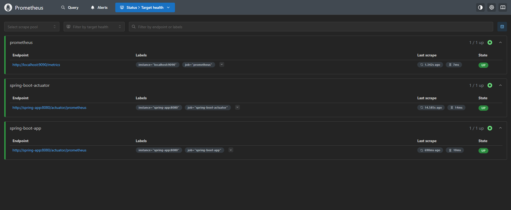

# Spring Boot Monitoring with Prometheus and Grafana

This project demonstrates a complete monitoring setup for a Spring Boot application using Prometheus for metrics collection and Grafana for visualization.

## Architecture

```
┌─────────────────┐    ┌─────────────────┐    ┌─────────────────┐
│   Spring Boot   │───▶│   Prometheus    │───▶│     Grafana     │
│   Application   │    │                 │    │                 │
│   (Port 8080)   │    │   (Port 9090)   │    │   (Port 3000)   │
└─────────────────┘    └─────────────────┘    └─────────────────┘
                                │
                                ▼
                       ┌─────────────────┐
                       │  AlertManager   │
                       │   (Port 9093)   │
                       └─────────────────┘
```

## Features

### Spring Boot Application
- **Actuator Endpoints**: Health, metrics, info, and more
- **Custom Metrics**: Business operations, API requests, response times
- **Prometheus Integration**: Metrics exported in Prometheus format
- **Spring Boot Admin**: Web-based admin interface

### Custom Metrics Implemented
- `api_requests_total`: Counter for total API requests
- `api_response_time`: Timer for API response times
- `active_users`: Gauge for current active users
- `business_operations_total`: Counter for business operations
- `business_processing_time`: Timer for business processing
- `order_value`: Distribution summary for order values
- `business_errors_by_type`: Counter for errors by type

### Monitoring Stack
- **Prometheus**: Metrics collection and storage
- **Grafana**: Data visualization and dashboards
- **AlertManager**: Alert management and notifications

## Quick Start

### Prerequisites
- Docker and Docker Compose
- Java 21 (for local development)
- Maven (for local development)

### Running with Docker Compose

1. **Start the entire monitoring stack:**
   ```bash
   docker-compose up -d
   ```

2. **Access the services:**
   - **Spring Boot App**: http://localhost:8080
   - **Prometheus**: http://localhost:9090
   - **Grafana**: http://localhost:3000 (admin/admin123)
   - **AlertManager**: http://localhost:9093

3. **Stop the stack:**
   ```bash
   docker-compose down
   ```

### Running Locally (Development)

1. **Start Prometheus and Grafana:**
   ```bash
   docker-compose up prometheus grafana alertmanager
   ```

2. **Run Spring Boot application:**
   ```bash
   mvn spring-boot:run
   ```

## Endpoints

### Application Endpoints
- `GET /` - Home page with endpoint information
- `GET /api/hello` - Simple hello endpoint with metrics
- `GET /api/metrics-demo` - Demonstrates various metrics
- `GET /api/business-metrics` - Records business operation metrics
- `GET /api/error-demo` - Simulates errors for error metrics

### Actuator Endpoints
- `GET /actuator/health` - Application health status
- `GET /actuator/metrics` - Available metrics
- `GET /actuator/prometheus` - Prometheus formatted metrics
- `GET /actuator/info` - Application information
- `GET /actuator/beans` - Spring beans information
- `GET /actuator/env` - Environment properties

### Monitoring Endpoints
- `GET /health-summary` - Quick health check
- `GET /app-info` - Application information
- `GET /metrics-list` - List of available metrics

## Grafana Dashboard

The pre-configured dashboard includes:
- **API Request Rate**: Requests per second
- **Active Users**: Current number of active users
- **Response Time**: Average and 95th percentile response times
- **Business Operations**: Rate of business operations
- **JVM Memory Usage**: Memory consumption breakdown
- **Order Value Metrics**: Order value distribution

### Dashboard Features
- Real-time monitoring
- Historical data analysis
- Alerting capabilities
- Custom time ranges
- Multiple visualization types

# Screenshots

Visual examples of the monitoring stack. Add your own screenshots by placing image files in the repository and updating the paths below.

## Grafana Dashboard

*Example: Spring Boot Monitoring Dashboard in Grafana*

## Prometheus UI

*Example: Prometheus metrics browser and query interface*

> **How to add screenshots:**
> 1. Take a screenshot of the Grafana dashboard or Prometheus UI.
> 2. Save the image in the appropriate folder (e.g., `grafana/screenshots/` or `prometheus/screenshots/`).
> 3. Update the image path in this section if needed.

## Configuration Files

### Docker Compose (`docker-compose.yml`)
- Defines all services and their relationships
- Sets up networking between containers
- Configures volumes for data persistence

### Prometheus (`prometheus/prometheus.yml`)
- Scrape configurations for Spring Boot metrics
- Alert rules and evaluation intervals
- Integration with AlertManager

### Grafana Configuration
- **Data Sources** (`grafana/provisioning/datasources/prometheus.yml`): Prometheus connection
- **Dashboards** (`grafana/provisioning/dashboards/dashboard.yml`): Dashboard provisioning
- **Dashboard JSON** (`grafana/dashboards/spring-boot-dashboard.json`): Pre-built monitoring dashboard

### AlertManager (`alertmanager/alertmanager.yml`)
- Alert routing and grouping rules
- Notification configurations
- Webhook integrations

## Development

### Adding Custom Metrics

1. **Inject MeterRegistry in your service:**
   ```java
   @Autowired
   private MeterRegistry meterRegistry;
   ```

2. **Create metrics:**
   ```java
   // Counter
   Counter counter = Counter.builder("my_custom_counter")
       .description("Description of counter")
       .register(meterRegistry);
   
   // Timer
   Timer timer = Timer.builder("my_custom_timer")
       .description("Description of timer")
       .register(meterRegistry);
   
   // Gauge
   Gauge.builder("my_custom_gauge")
       .register(meterRegistry, obj, obj -> obj.getValue());
   ```

### Testing Metrics

1. **Generate some load:**
   ```bash
   # Hit the metrics demo endpoint multiple times
   for i in {1..10}; do curl http://localhost:8080/api/metrics-demo; done
   
   # Generate business metrics
   for i in {1..5}; do curl http://localhost:8080/api/business-metrics; done
   ```

2. **Check Prometheus targets:**
   - Visit http://localhost:9090/targets
   - Ensure Spring Boot app target is UP

3. **Query metrics in Prometheus:**
   - Visit http://localhost:9090
   - Try queries like: `api_requests_total`, `api_response_time_sum`

4. **View in Grafana:**
   - Visit http://localhost:3000
   - Login with admin/admin123
   - Navigate to the Spring Boot Monitoring Dashboard

## Troubleshooting

### Common Issues

1. **Container networking issues:**
   ```bash
   docker-compose logs spring-app
   docker-compose logs prometheus
   ```

2. **Metrics not appearing:**
   - Check if Prometheus can scrape the Spring Boot app
   - Verify `/actuator/prometheus` endpoint is accessible
   - Check Prometheus targets page

3. **Grafana dashboard not loading:**
   - Verify Prometheus data source configuration
   - Check if data source is accessible from Grafana container

### Useful Commands

```bash
# View logs
docker-compose logs -f spring-app

# Restart specific service
docker-compose restart prometheus

# Remove all data and restart fresh
docker-compose down -v
docker-compose up -d

# Access container shell
docker-compose exec spring-app bash
```

## Production Considerations

1. **Security:**
   - Change default Grafana credentials
   - Use proper authentication for Prometheus
   - Secure AlertManager webhooks

2. **Performance:**
   - Configure appropriate scrape intervals
   - Set up proper retention policies
   - Monitor resource usage

3. **High Availability:**
   - Use Prometheus clustering
   - Set up Grafana HA
   - Configure persistent storage

4. **Alerting:**
   - Define meaningful alert rules
   - Set up proper notification channels
   - Test alert routing

## Contributing

1. Fork the repository
2. Create a feature branch
3. Make your changes
4. Add tests for new metrics
5. Submit a pull request

## License

This project is licensed under the MIT License.
